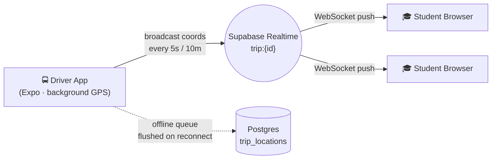

# 🚌 RideSync — Real-Time College Bus Tracking

> Students wait at bus stops with no idea when the bus is coming. RideSync puts the live bus on a map — no app install, no account, just a short code.

<p>
  
  
  
  
  
</p>

---

## 🎥 Demo

<!-- DEMO: replace the URL below with your video link, then delete this comment -->
**▶️ [Watch the 2-minute demo](REPLACE_WITH_YOUR_DEMO_VIDEO_URL)**

> _Screenshots / GIFs coming soon — the fastest way to make this repo pop for a reviewer._

---

## The Problem

College students crowd bus stops in the rain and heat with zero visibility into where their bus actually is. Timetables are fiction; buses run early, late, or not at all.

RideSync solves this with a **two-sided, friction-free** system:

| Actor | What they do | Platform |
|---|---|---|
| **Driver** | Log in → tap a map to pin stops → tap **START** → drive | React Native (Expo) app |
| **Student** | Open a link → type the driver's code (e.g. `DRV001`) → watch the live bus + per-stop ETAs | Any web browser (Next.js) |

**Core design constraint:** drivers are non-technical. Their entire daily workflow is _one button_.

---

## How It Works

The driver app streams GPS over a **Supabase Realtime** channel (`trip:{trip_id}`). Student browsers subscribe over WebSocket and receive coordinates in real time — **nothing is written to the database on the live path**, so fan-out stays sub-100ms and free-tier friendly. ETAs use the **OSRM** routing API for real road distances, with a Haversine fallback when rate-limited.



- **Background tracking** via `expo-location` + `expo-task-manager` — keeps streaming with the screen locked.
- **Offline queue** — coordinates buffered in `AsyncStorage` during dead zones, bulk-flushed on reconnect.
- **Heartbeat** — trips auto-close after 30 min of silence if a driver forgets to tap STOP.
- **Road-following routes** — both apps draw the real road polyline (OSRM geometry), not straight lines.

Full design write-up: [`system_design.md`](./system_design.md) · Agent handoff notes: [`context.md`](./context.md)

---

## Tech Stack

| Layer | Tech |
|---|---|
| Driver app | React Native, Expo (SDK 57), `react-native-maps`, TypeScript |
| Student web | Next.js (App Router), React, Leaflet / OpenStreetMap, TypeScript |
| Realtime + DB | Supabase Realtime (WebSocket broadcast), PostgreSQL + Row-Level Security |
| Routing / ETA | OSRM API with Haversine fallback |

---

## Repo Structure

```
RIDESYNC/
├── apps/
│   ├── driver/       # React Native (Expo) — driver-facing app
│   └── web/          # Next.js — student-facing tracking site
├── supabase/
│   └── schema.sql    # Postgres schema, RLS policies, helper functions
├── system_design.md  # Full architecture + diagrams
└── context.md        # Engineering handoff notes
```

---

## Quickstart

**Prerequisites:** Node 18+, a free [Supabase](https://supabase.com) project, and the Expo Go app for the driver side.

```bash
# 1. Backend — run supabase/schema.sql in the Supabase SQL Editor,
#    then enable Realtime for: drivers, routes, stops, trips.

# 2. Student web app
cd apps/web
cp .env.example .env.local   # add your Supabase URL + anon key
npm install
npm run dev                  # → http://localhost:3000

# 3. Driver app
cd apps/driver
cp .env.example .env         # add your Supabase URL + anon key
npm install
npx expo start               # scan the QR with Expo Go
```

Environment variables are documented in each app's `.env.example`.

---

## License

[MIT](./LICENSE) © Mounish Sai
