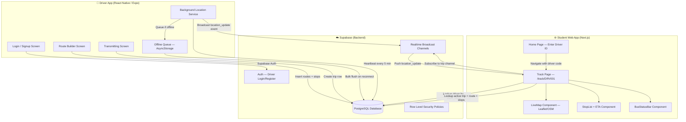
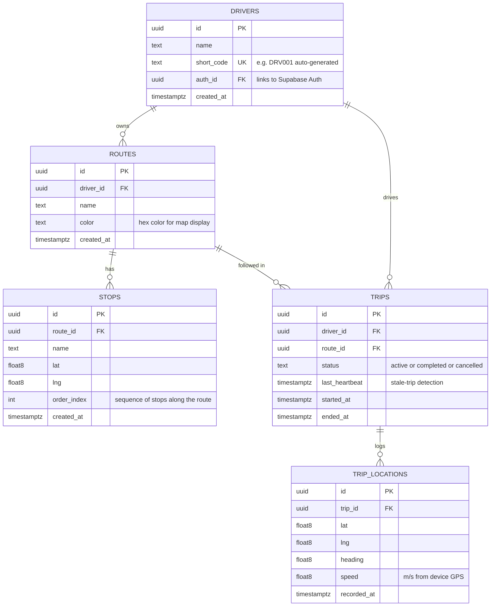
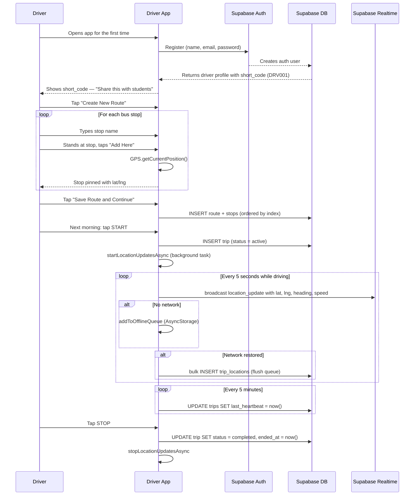
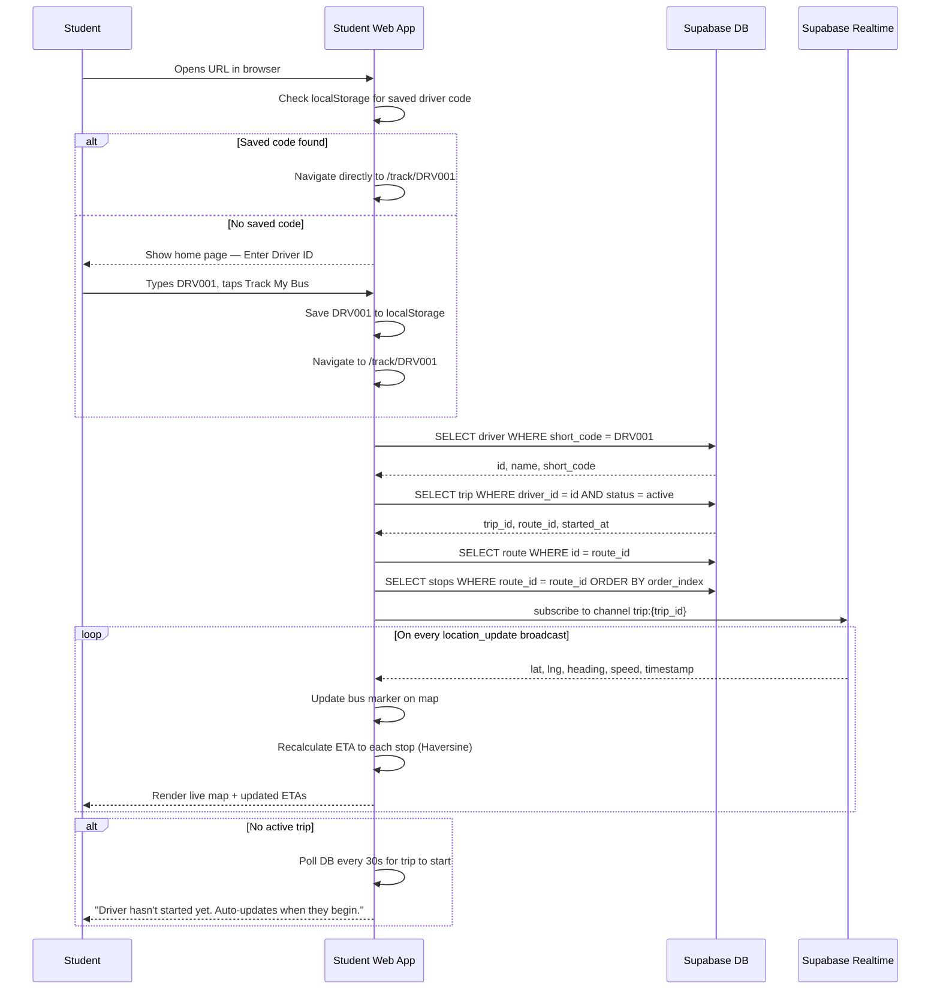
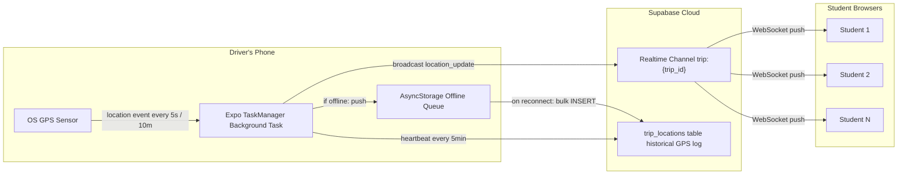
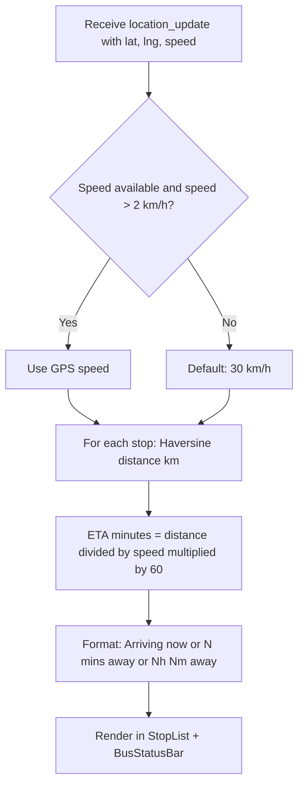

# RideSync — System Design

## 1. What is RideSync?

RideSync is a real-time bus tracking system built for college students who are tired of waiting at a bus stop not knowing when the bus will arrive. It solves two distinct problems at once:

- **For students**: Know exactly where the bus is and how many minutes away each stop is — from a browser, no download needed.
- **For drivers**: A dead-simple native app where they build their route once and then just tap START every morning. No complex navigation, no config.

The architecture was deliberately designed around one constraint: **drivers are non-technical**. The entire UX must survive a first-time smartphone user.

---

## 2. System Architecture Overview



---

## 3. Data Model



**Key design decisions:**
- Routes are **driver-owned** — no admin/org layer needed. Drivers self-register.
- Stops are stored as **ordered GPS coordinates** (lat/lng + order_index), not street addresses. The driver physically stands at each stop and taps "Add Here".
- `TRIP_LOCATIONS` stores historical GPS log, but **live location is NOT written to DB every ping** — it is broadcast via Supabase Realtime channels, keeping database costs near zero.
- `last_heartbeat` enables a scheduled Postgres function (`complete_stale_trips()`) to auto-close trips where the driver closed the app without tapping STOP.

---

## 4. Driver App Flow



---

## 5. Student Web App Flow



---

## 6. Real-Time Location Pipeline



**Key behaviour:**
- Location is **broadcast-only** (not persisted) during live trips → sub-100ms latency, $0 database write cost per ping.
- The offline queue (`AsyncStorage`) absorbs location events during cellular dead zones. Events are bulk-flushed to `trip_locations` when connectivity returns.
- Heartbeat writes to the DB every 5 minutes so the scheduled `complete_stale_trips()` function can auto-close abandoned trips.

---

## 7. ETA Calculation



**Note:** The bus does NOT follow the shortest path — it follows the actual road including complex intersections and multi-turn routes. ETAs recalculate from the bus's **live GPS position** to each stop. We use the public **OSRM routing API** for accurate driving times. Because the public OSRM server has rate limits, the web app restricts network ETA requests (e.g. max once per 15 seconds) and falls back to Haversine straight-line distance if the API fails or limits are exceeded. No turn-by-turn routing engine dependency needed on the device.

---

## 8. Security Model (Row Level Security)

| Table | Public SELECT | Driver INSERT/UPDATE/DELETE |
|---|---|---|
| `drivers` | Anyone can look up a driver by short_code | Own row only (auth.uid = auth_id) |
| `routes` | Anyone can read routes | Own routes only |
| `stops` | Anyone can read stops | Own stops only (via route ownership) |
| `trips` | Anyone can see active trips | Own trips only |
| `trip_locations` | Not exposed (historical only) | Own trips only |

Students access driver data **without any authentication** — they just enter a Driver ID. No signup, no session, no token. This is intentional to minimize friction.

---

## 9. Tech Stack Summary

| Layer | Technology | Rationale |
|---|---|---|
| Driver App | React Native (Expo) | Cross-platform iOS + Android, background GPS via expo-location + expo-task-manager |
| Student Web App | Next.js (App Router) | No download, works in any browser, PWA-ready |
| Maps | Leaflet + OpenStreetMap | Free, no API key, excellent mobile performance |
| Backend / DB | Supabase (PostgreSQL) | Realtime WebSockets, Auth, RLS — all managed, free tier |
| Live Broadcast | Supabase Realtime Broadcast | Sub-100ms, no DB writes per ping |
| Hosting | Vercel | One-click deploy for web app, free tier |
| Offline Cache | AsyncStorage (React Native) | Native key-value store for GPS queue during dead zones |
| ETA Engine | Custom Haversine (TypeScript) | Zero dependency, fast, works offline in browser |

---

## 10. File Structure

```
RIDESYNC/
├── apps/
│   ├── driver/                             # React Native (Expo) — Driver app
│   │   ├── App.tsx                         # Root navigator (Login → RouteBuilder → Transmitting)
│   │   ├── src/
│   │   │   ├── screens/
│   │   │   │   ├── LoginScreen.tsx         # Auth — email/password login
│   │   │   │   ├── SignUpScreen.tsx        # Auth — registration + short_code display
│   │   │   │   ├── RouteBuilderScreen.tsx  # Create/select routes + pin stops at GPS location
│   │   │   │   ├── RouteSelectScreen.tsx   # Alternate route picker (legacy)
│   │   │   │   └── TransmittingScreen.tsx  # START/STOP button + trip status
│   │   │   └── lib/
│   │   │       ├── locationService.ts      # Core: background GPS, broadcast, offline queue, heartbeat
│   │   │       ├── supabase.ts             # Supabase client (driver app)
│   │   │       └── storage.ts              # AsyncStorage helpers (driver profile, last route)
│   │   └── eas.json                        # Expo Application Services build config
│   │
│   └── web/                                # Next.js — Student web app
│       └── src/
│           ├── app/
│           │   ├── page.tsx                # Home: enter Driver ID
│           │   └── track/[driverCode]/
│           │       └── page.tsx            # Live tracker: map + stops + ETAs
│           ├── components/
│           │   ├── LiveMap.tsx             # Leaflet map with bus marker + stop pins
│           │   ├── StopList.tsx            # Ordered stop list with live ETAs
│           │   └── BusStatusBar.tsx        # Live/Offline badge + speed + last-seen
│           └── lib/
│               ├── supabase.ts             # Supabase client + TypeScript types
│               ├── eta.ts                  # Haversine, ETA calculation, speed/time formatters
│               └── storage.ts              # localStorage helpers (saved driver code)
│
└── supabase/
    └── schema.sql                          # Full DB schema: tables, RLS policies, helper functions
```

---

## 11. Known Challenges & Mitigations

| Challenge | Mitigation |
|---|---|
| Battery drain on driver's phone | distanceInterval: 10m — only fires when bus moves. Expo TaskManager handles OS-level battery optimisation. |
| Cellular dead zones | AsyncStorage offline queue — coordinates saved locally, bulk-flushed on reconnect. |
| Driver closes app without tapping STOP | last_heartbeat + complete_stale_trips() Postgres function — auto-closes trip after 30 min of silence. Run via pg_cron or Supabase Edge Function. |
| Bus takes detours (not shortest path) | Routes are stop-sequences, not turn-by-turn paths. ETA recalculates from live GPS position always. Students visually see the detour on the map. |
| OSRM Rate Limits | The public free OSRM API is used for accurate ETAs, but can rate limit if spammed. The web app fetches ETAs sequentially and caches them for 15s. If rate limits are hit, it gracefully falls back to the local Haversine (straight-line) calculation. |
| Driver unfamiliar with phones | One-screen UX: just a big START/STOP button. Route is remembered from last session. |
| Multiple students subscribing at once | Supabase Realtime fan-out handles N subscribers on one broadcast channel — no per-student cost. |
